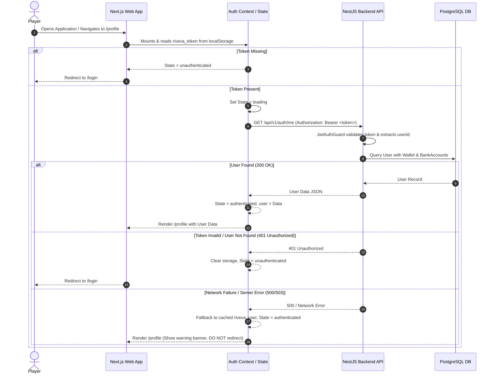

# Auth Mapping: Laravel to Next.js + NestJS

## 1. Overview
This document maps the authentication and session architecture from the Laravel source of truth (`fiewin`) to the target Next.js + NestJS application (`gaming-platform`).

---

## 2. Authentication Lifecycle & Protocol Mapping

| Concept | Laravel Implementation (`fiewin`) | Next.js + NestJS Implementation (`gaming-platform`) |
| :--- | :--- | :--- |
| **Authentication Strategy** | Web Guard (`Illuminate\Auth\SessionGuard`) with encrypted cookies & session storage (`laravel_session`). | Token-based auth (`jwt_session_<userId>_<timestamp>`) sent via `Authorization: Bearer <token>` headers + `localStorage` (`rivexa_token`, `rivexa_user`). |
| **Login Route** | `POST /login` (`LoginController@login`) | `POST /api/v1/auth/login` (`AuthController.login`) |
| **Registration Route** | `POST /register` (`RegisterController@register`) | `POST /api/v1/auth/register` (`AuthController.register`) |
| **Current User Identity** | `auth()->user()` or `request()->user()` | `GET /api/v1/auth/me` protected by `JwtAuthGuard` reading `Authorization: Bearer <token>` |
| **Password Validation** | `Hash::check($password, $user->password)` | `comparePassword(password, user.passwordHash)` using bcrypt (`@gaming-platform/auth`) |
| **Logout** | `POST /logout` (`LoginController@logout`) | Frontend token removal + `POST /api/v1/auth/logout` (or client state reset) -> redirect `/login` |
| **Route Guard** | `middleware('auth')` on web routes | Client-side `AuthContext` hydration check on `/profile` route + NestJS `JwtAuthGuard` on APIs |

---

## 3. Hydration & Persistence Flow

---

## 4. Root Cause Analysis of Previous Redirect Issue
1. **Hardcoded Navigation Link**: `apps/web/src/components/Navigation.tsx` hardcoded the `Profile` bottom navigation item `href` directly to `/login`.
2. **Missing Profile Route**: `apps/web/src/app/profile/page.tsx` did not exist.
3. **Unprotected Endpoint / Query Param Dependency**: `GET /api/v1/auth/me` accepted a loose `@Query('userId')` without requiring authentication via `JwtAuthGuard`.
4. **Lack of Centralized Auth Hydration**: React components were reading `localStorage` directly on a per-page basis without a proper `loading` state, causing race conditions where `user = null` triggered premature redirects to `/login`.
